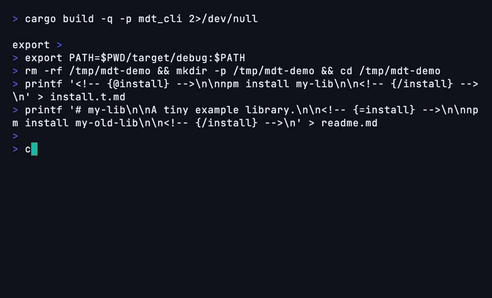

<p align="center">
  
</p>

# mdt

**Write it once, sync it everywhere.**

Markdown templates that keep your READMEs, doc comments, and docs sites in sync, with data interpolation, transformers, and CI verification.

<p align="center">
  
</p>

<br />

[![Status][ci-status-image]][ci-status-link] [![Coverage][coverage-image]][coverage-link] [![Unlicense][unlicense-image]][unlicense-link]

<br />

<!-- {=mdtPackageDocumentation} -->

`mdt` helps library and tool maintainers keep README sections, source-doc comments, and docs-site content in sync across a project. Define content once with comment-based template tags, then reuse it across markdown files, code documentation comments, READMEs, mdbook docs, and more, so your docs do not drift.

<!-- {/mdtPackageDocumentation} -->

<!-- {=mdtBeforeAfter} -->

## The Problem

You have the same install instructions in three places:

**readme.md:**

```markdown
## Installation

npm install my-lib
```

**src/lib.rs:**

```rust
//! ## Installation
//!
//! npm install my-lib
```

**docs/getting-started.md:**

```markdown
## Installation

npm install my-lib
```

You update one. The others drift. CI doesn't catch it.

## The Fix

Define it once in a `*.t.md` template file (the "t" stands for template):

```markdown
<!-- {@install} -->

npm install my-lib

<!-- {/install} -->
```

Use it everywhere:

```markdown
<!-- {=install} -->

(replaced automatically)

<!-- {/install} -->
```

Run `mdt update` and all three files are in sync. Run `mdt check` in CI and drift is caught before merge.

<!-- {/mdtBeforeAfter} -->

## Installation

<!-- {=mdtCliInstall} -->

- Install the prebuilt binary with npm:

```sh
npm install -g @m-d-t/cli
```

- Or run it without installing:

```sh
npx -y @m-d-t/cli --help
```

- Or download a prebuilt binary from the [latest GitHub release](https://github.com/ifiokjr/mdt/releases/latest).
- Or build from source with Cargo (slower):

```sh
cargo install mdt_cli
```

<!-- {/mdtCliInstall} -->

## Quick Start

<!-- {=mdtQuickStart} -->

### 1. Initialize

```sh
mkdir my-project && cd my-project
mdt init
```

`mdt init` creates `mdt.toml`, a sample `greeting` provider in `.templates/template.t.md`, and, because the project has no README yet, a `readme.md` whose `greeting` consumer is already in sync.

### 2. Edit the provider

In `.templates/template.t.md`:

```markdown
<!-- {@greeting} -->

Hello from mdt! Edit me once, update everywhere.

<!-- {/greeting} -->
```

### 3. Reuse it

Add a consumer to any other markdown file, for example `docs/intro.md`:

```markdown
<!-- {=greeting} -->
<!-- {/greeting} -->
```

### 4. Sync and verify

```sh
mdt update
mdt check
```

`mdt update` writes the provider's content into every `greeting` consumer. `mdt check` exits non-zero when a consumer is out of date or names no provider, so run it in CI.

<!-- {/mdtQuickStart} -->

## Learn More

- [Quick Start](./docs/src/getting-started/quick-start.md)
- [Template Syntax](./docs/src/reference/template-syntax.md)
- [CLI Reference](./docs/src/reference/cli.md)
- [Data Interpolation](./docs/src/guide/data-interpolation.md)
- [Transformers](./docs/src/reference/transformers.md)
- [Configuration](./docs/src/guide/configuration.md)
- [CI Integration](./docs/src/guide/ci-integration.md)
- [Source File Support](./docs/src/guide/source-files.md)
- [Proof of Value](./docs/src/getting-started/proof-of-value.md)
- [Migration Walkthrough](./docs/src/getting-started/migration-walkthrough.md)

## AI Coding Assistants

The `mdt` binary carries an agent skill that teaches assistants the tag syntax, transformers, configuration, and workflow for the installed version. Any agent that can run shell commands can load it:

```sh
mdt skill              # print the skill
mdt skill --reference  # print the detailed reference
```

Or install it where your agent looks for skills:

```sh
mdt skill --install .claude/skills   # Claude Code
mdt skill --install .agents/skills   # Codex and other agents
mdt skill --install .github/skills   # GitHub Copilot
```

The same skill is published as [`@m-d-t/skills`](https://www.npmjs.com/package/@m-d-t/skills) for [Pi](https://pi.dev) (`pi install npm:@m-d-t/skills`). For MCP setup, run `mdt assist <claude|cursor|copilot|pi|generic>`; see [Assistant Setup](./docs/src/getting-started/assistant-setup.md).

## Crates

| Crate                    | Description                                                                    |
| ------------------------ | ------------------------------------------------------------------------------ |
| [`mdt_core`](./mdt_core) | Core library — lexer, parser, scanner, and template engine                     |
| [`mdt_cli`](./mdt_cli)   | CLI tool — `mdt` binary for managing templates                                 |
| [`mdt_lsp`](./mdt_lsp)   | LSP server — editor integration with diagnostics, completions, hover, and more |
| [`mdt_mcp`](./mdt_mcp)   | MCP server — AI assistant integration via the Model Context Protocol           |

## Contributing

<!-- {=mdtContributing} -->

[`devenv`](https://devenv.sh/) provides a reproducible development environment for this project. Follow its [getting started instructions](https://devenv.sh/getting-started/), then enter the environment from the repository root:

```bash
devenv shell
```

Run `install:all` to install the remaining tooling. Repository commands such as `build:all`, `test:all`, `lint:all`, and `fix:all` are available inside the shell.

<!-- {/mdtContributing} -->

[ci-status-image]: https://github.com/ifiokjr/mdt/workflows/ci/badge.svg
[ci-status-link]: https://github.com/ifiokjr/mdt/actions?query=workflow:ci
[coverage-image]: https://codecov.io/gh/ifiokjr/mdt/branch/main/graph/badge.svg
[coverage-link]: https://codecov.io/gh/ifiokjr/mdt
[unlicense-image]: https://img.shields.io/badge/license-Unlicense-blue.svg
[unlicense-link]: https://opensource.org/license/unlicense
